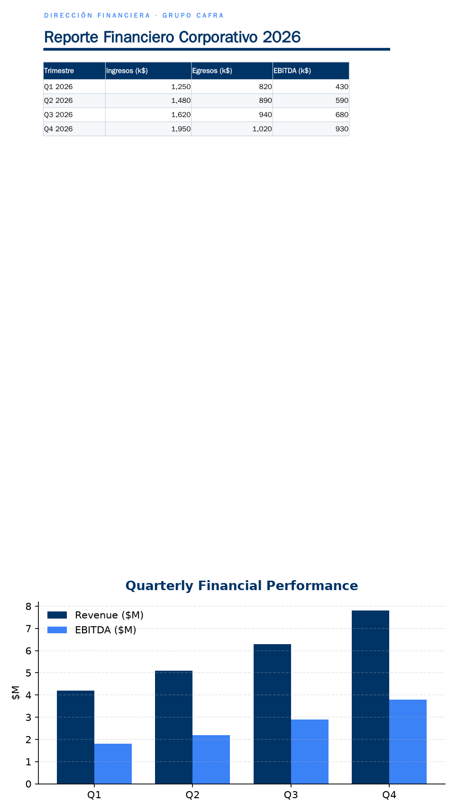
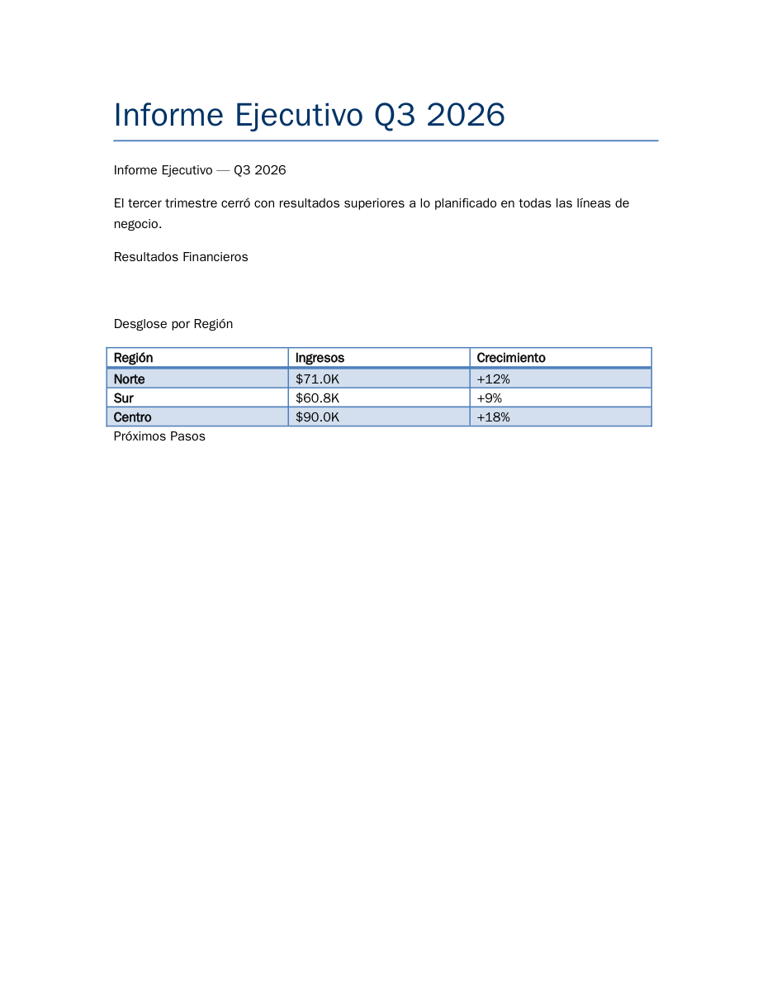
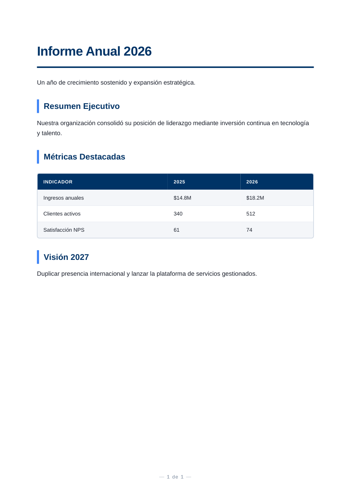

# The Office Worker — `office-worker-mcp`


**The complete document MCP for AI agents.** Generate, edit, secure, audit and extract professional **PDF, Word, Excel and PowerPoint** documents — fully local, zero API keys, deterministic and safe. Built for Hermes, Claude and Cursor via [MCP](https://modelcontextprotocol.io).

<!-- mcp-name: io.github.CaFra-House/office-worker-mcp -->

## Requirements (read this first)

| Platform | Path to all 30 tools |
|----------|----------------------|
| **Any OS with Docker** (on Windows via Docker Desktop with WSL2/Hyper-V backend) | Official image — recommended: see [Full setup](#full-setup--all-30-tools-zero-friction-recommended) below or [docs/docker.md](docs/docker.md) |
| **Linux / macOS (bare metal)** | `pip install "office-worker-mcp[pdf]"` + system binaries for the 3 capabilities pip can't ship (LibreOffice → Office→PDF, Tesseract → OCR, Pango/Cairo → WeasyPrint; `convert_to_pdf` uses LibreOffice and does not need weasyprint). Run `owi doctor` once: it prints the exact one-line install command for your OS. The server also warns you at startup if anything is missing. |
| **Windows (bare metal)** | **Partial support only.** Word/Excel/PPTX, PDF read/extract, security and `convert_to_pdf` work natively; premium PDF rendering (WeasyPrint), OCR and books do NOT — they need native C libs with no unattended Windows installer. Docker image needs WSL2/Hyper-V or Docker Desktop; on LTSC without Hyper-V there is no full-setup path. Details: [docs/extras.md](docs/extras.md) |

```bash
pip install office-worker-mcp          # core: MCP server + CLI 'owi'
```

Connect it to your agent (stdio):

```json
{ "mcpServers": { "office-worker": { "command": "office-worker-mcp" } } }
```

## Full setup — all 30 tools, zero friction (recommended)

The core pip package covers the full document lifecycle; three capabilities need system binaries that `pip` cannot ship (LibreOffice for Office→PDF conversion, Tesseract for OCR, Pango/Cairo native libs for WeasyPrint). The official Docker image bundles **everything** and runs on any OS with Docker — on Windows it runs via Docker Desktop (WSL2/Hyper-V backend):

```bash
docker pull ghcr.io/cafra-house/office-worker-mcp:latest
```

```json
{
  "mcpServers": {
    "office-worker": {
      "command": "docker",
      "args": ["run", "-i", "--rm", "-v", "${HOME}/office-worker-data:/data", "ghcr.io/cafra-house/office-worker-mcp:latest"]
    }
  }
}
```

Prefer bare metal? Run `owi doctor` after `pip install` — it reports exactly which capability is inactive and prints the one-line install command for your OS (apt/brew/dnf/winget). Details in [docs/docker.md](docs/docker.md) and [docs/extras.md](docs/extras.md).

## See it in action

Real documents generated by the MCP itself — no manual editing, no cloud:

| Excel dashboard + native chart | Executive report (Word) | Native-chart deck (PPTX) | Premium PDF (editorial design) |
|:---:|:---:|:---:|:---:|
|  |  |  |  |

- **Excel** — `create_excel` structured table + autofilter + `edit_excel add_chart` / `add_pivot` native pivot sheet
- **Word** — `create_word` executive report with headings, bullets and a data table, corporate theme
- **PPTX** — `create_pptx` multi-slide deck with a native DrawingML bar chart
- **PDF** — `render_document(design_mode="premium")` editorial layout with metrics table

## What you get

One package covers the entire document lifecycle — create → read → extract → convert → secure → sign → audit — with honest fidelity reporting (`rich` | `clean` | `lossy`) and proactive `next_steps` guidance on every creation tool.

- **Create** — Word / Excel / PPTX / PDF from templates or declarative blocks; corporate themes, logos, watermarks, premium editorial design mode
- **Read & extract** — structured Markdown/JSON for RAG (`read_office`, `pdf_extract_structured`) + embedded images as base64 for multimodal agents
- **Convert** — PDF ↔ Office ↔ CSV bidirectionally with explicit fidelity warnings
- **Secure** — irreversible redaction (`pdf_redact`), metadata scrubbing (`scrub_metadata`), password encryption (`protect_office`), form flattening for archival compliance
- **Sign & audit** — real PAdES signatures (`sign_pdf`) + cryptographic verification (`verify_pdf_signature`), honest document diffing (`document_diff`)
- **Productivity** — mail merge (`mail_merge`), native Excel pivots (`add_pivot`), native PPTX charts, multi-chapter books with auto TOC (`create_book`)
- **Onboarding** — `owi doctor` environment diagnostics with per-OS install hints; packaged skills installable via `owi skill install`

### Efficiency (measured)

~2550 tokens/turn across 30 specialized tools vs ~6400 for a typical 47-tool CRUD suite — less bloat, more stable agents, lower cost. Measured, not claimed.

## Documentation

| Topic | Where |
|---|---|
| Full reference of all 30 tools (returns / use when / do-not-use) | [docs/tools.md](docs/tools.md) |
| Competitive comparison & why we're the one to install | [docs/comparison.md](docs/comparison.md) |
| Ten end-to-end conversational workflows (EN) | [docs/workflows.md](docs/workflows.md) |
| Optional extras ([pdf] [ocr] [sign] [book] [pptx]) & honest platform limits | [docs/extras.md](docs/extras.md) |

## Develop & test

```bash
pip install -e ".[dev,book]"
pytest -q            # full suite verified on disk (46 passed)
python count_tokens.py   # live token-budget audit (2550.75 tok v0.9.0, <2600 target)
```

## License

MIT — see [LICENSE](LICENSE). Acknowledgements in [NOTICE](NOTICE). Maintained by CaFra-House.

